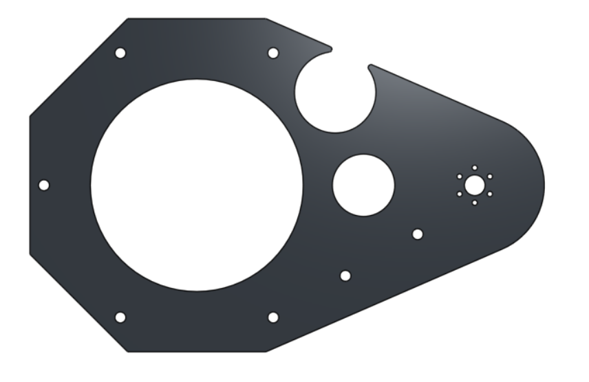
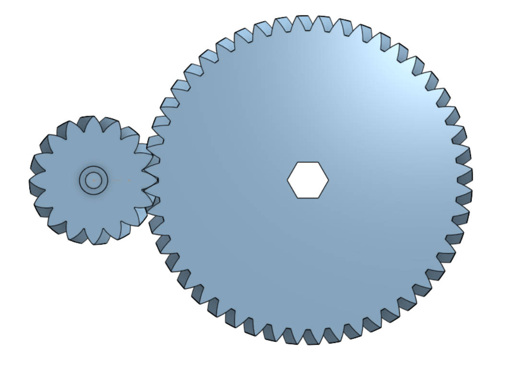
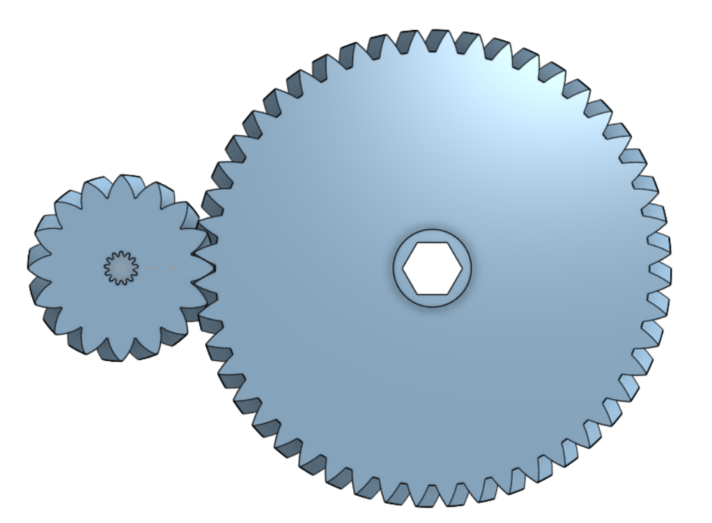
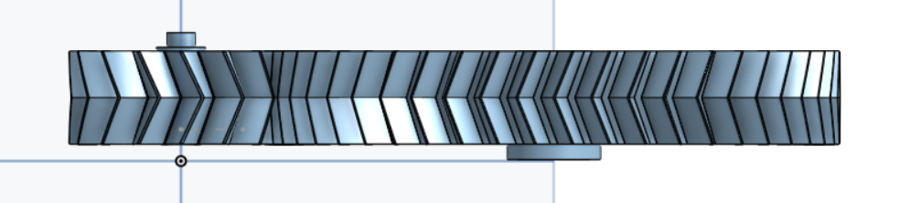

### Total time spent: 0 Hours

#### Onshape Link: https://cad.onshape.com/documents/4e4e67b789c32e1c62490b55/w/3b147ca839286fae5a01baae/e/5d2ccd93d79c945d351b1f5a
## Day 1 - Designing the Base of the Swerve Drive - April 23rd - 0 Hours

Today was just laying down the basics of the swerve drive by making the individual module. I did some research into which motors I want to use, and I decided to use the HD Hex motor and the Core Hex motor from Rev Robotics because they have a small form factor and are brushed motors. The brushed motors allow me to use cheaper motor controllers instead of the expensive $50-100 ones that can be sold online. 

Here is a link to the HD Hex motor and Core motor, respectively:
https://www.revrobotics.com/REV-41-1291/
https://www.revrobotics.com/rev-41-1300/

The motor controller is the next big part of this project, and I found one relatively quickly that meets all the requirements. It has an 8 A continuous current rating and a 15 A peak current rating. The HD Hex motor has a stall current of 8.5 A, and the Core motor has a stall of 4.4 A. That is 12.9 A combined at stall, and it works perfectly. Each motor controller can support 2 motors, so there can be one motor controller for each module, simplifying everything significantly. The only issue is that they only have 2 left in stock, so I would either have to wait or find a new motor controller. 

Here is the link to the motor controller I plan on using: 
https://www.robotshop.com/products/dual-h-bridge-dc-motor-controller?srsltid=AfmBOoro6QaIrc8azvvy7qUHnBC8t_rmFe9d5oKzDVSwgjFejJFZqI1GqEc

That was just the research to get started; here is the actual CAD that was worked on most of today. 

I started off with just making a rough 3in wheel and then made the bevel gears that attach to the sides. Starting here is important because the entire module is built around the diameter and thickness of your wheel. The bevel gear runs at a 4:1 reduction, and it is one of two reductions from the motor to the wheel. The wheel is also driven by a .5in hex shaft because I am already getting a lot of items from Rev Robotics, so integrating the items they sell into this project would reduce the number of vendors to buy from. I also have access to a bunch of tools from my FRC team that can help in cutting the hex axles. In the future, if I have the budget, I would like to CNC metal bevel gears instead of 3D printing them for reliability; however, because of costs, it's not very feasible. The robot, as I envision it, likely won't go under heavy load as it will only weigh approximately thirty to forty pounds at most. 

Here is a side view:

Here is just the driving bevel gear:

I also did some part lightening on the wheel, so when it is 3D printed, it can be printed at 100% infil without much worry, and also for aesthetics. 

Here is an isometric view:

After getting the wheels made, I switched to making the mounting plate, as it also determines things like bolt mounting points, size of the module, etc. Here is a halfway done version that was good enough to get started with the support brackets for the wheels. 

Also as a side note, I modeled the bearings I want to use as Swerve Drive Specialties. The vendor I plan on getting 4" x 3.5" x .25" bearings from doesn't have a CAD or drawing, so I based it off of my best guesses for the size. It turns out that my guess was very close to the actual dimensions, so I didn't need to redo anything there. 

The brackets to mount the wheel onto took a surprising amount of time, as a lot of its geometry matters. I initially had a very rounded design, but I eventually settled on this very angular design. A key thing about the mounting brackets is the area it contacts the bearing, as more areas of contact reduce the pressure applied. There are also hex holes for 3/8in nuts, so using a wrench isn't required. 

 

In the holes, 1.125" OD .5" ID hex bearings are going to support the weight of the entire drivebase. There will be a hex axle that runs through everything. Between the mounting brackets and the wheel itself, there will be snap-on 3D printed spacers that will constrain the motion more securely. They are different sizes because the distance between the wheel and the mounting brackets is different on both sides. This is because the bevel gear adds significant thickness. 

The next order of business was to finish off the entire mounting plate that the wheel mounts would be attached to. While the basic plate was done, the motion transfer of turning the entire module still needs to be figured out. Because I'm trying to make this build requiring the least amount of specified hardware as possible, I decided to just use helical gears in a V pattern instead. The mounting seems incredibly chunky, but it houses everything inside of it, including the motion transfer to power the wheel itself. The large slot holes the helical gear that transfers the motion. 

Here is a top isometric view of it:

Here is the same isometric view with the driving helical gear shown. It is running on a 2:1 reduction. 

Another thing that also needed to be completed was the top mounting plate. Not only did it help clean up the look, but it also constrains the motion of the gears so they cannot pop up. 

The inside helical gears that transfer the motion is geared at a 1:1 ratio and are incredibly simple. On one end, it is constrained by a tiny bearing, and the other end has a hex axle with a hex bearing. 

The final thing is the mounting for it all. I decided to just make a basic shape and polish it up with mounting holes later, just so it is easier to visualize. It is two plates, one on top and one on the bottom, that "capture" the bearing in between, holding the entire module down securely. Because it is two parts, six holes around the center allow the use of bolts to secure everything properly. There is also a hole for mounting the other helical gear. 

Here is a view of both parts:

Here is an isometric view of just the top panel: 

Here is an isometric view of just the bottom panel:

Here is a top view with all of its geometry: 

Here are just some visualization photos of everything done so far in one piece. If anything is unclear/hard to see, the link to the OnShape document is linked at the very top of the journal for easy reference. 

Anyways, that was about everything done today so far, and the next task is to create the motor packaging that will power this entire setup. 

## Day 1 - Making the proper motion transfer - April 24rd - 1 Hours 37 mins

Today's focus was trying to figure out motor placement. It matters a lot because packaging impacts the footprint and arraigment of everything. 

Major thing was adding the hole for the HD hex motor in the mounting plates as I want the motor to be inverted (similar to the MK4n where the motors shafts are facing upwards) to have a smaller profile. This comes at the cost that the motors are more suceptable to damage over rougher terrain, however, this isn't mean't for much aside from inclines and bumps. Another major change I did with the mounting plate was the addition of the mounting points for the Core motor and more holes for the top mounting plate and bottom mounting plate to be secured together. 

Next thing I did was I added the helical gears that would transfer motion from the HD hex motor to the wheel. I'm going to adjust the gear ratios a bit more because the gear is way too big aesthetically for my liking. 

Here are some photos, the motion is going to be restrained on the top and bottom. 

Anyways, that was most of it for today. I wish I could have gotten more done, however, the helical spur gears are killing the OnShape regeneration time. 

Side note: I am going to be using an ESP-32 S3 for the micro-controller. I am researching how it works right now, but the main reason why I chose it was because it has wifi and bluetooth capabilities, meaning I can just use my phone or laptap and connect to it. Then using a website, you can control the robot. No fancy controller required. 